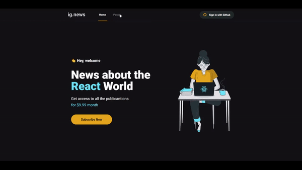

# Ig.news

Ig.news is a subscription news site project. Made in order to challenge myself and study the use of famous tools in the Nodejs ecosystem.<br>
To make this project possible, i have used <b>Stripe</b> to receive the payments and <b>FaunaDB</b> to storage de subscriptions, to content manager i have used <b>Prismic</b>, and finally, for authentication, I used the login with github through <b>NextAuth</b>.



## 📌 Used frameworks

&nbsp;&nbsp;&nbsp; &nbsp; &nbsp; &nbsp; &nbsp;

## 🧑‍💻 How install

1 - Clone this repository:

```bash
git clone https://github.com/asleeplevi/ignews.git
```

2 - Install de dependencies:

```bash
# npm
npm install
# or yarn
yarn install
```

3 - Run `dev` script

```bash
# npm
npm run dev
# or using yarn
yarn dev
```

Developed with ❤️ by levi
